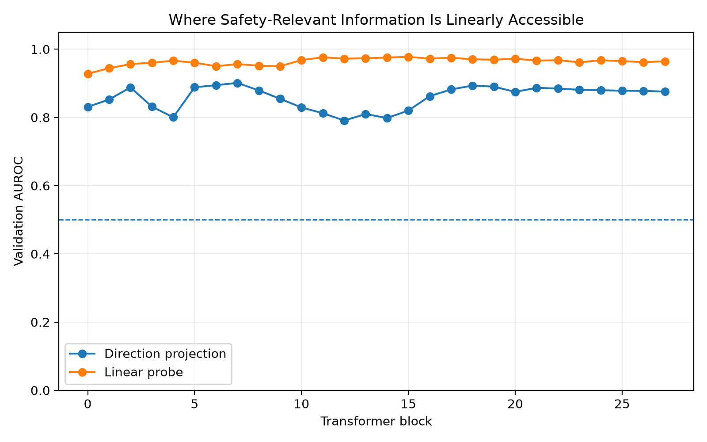
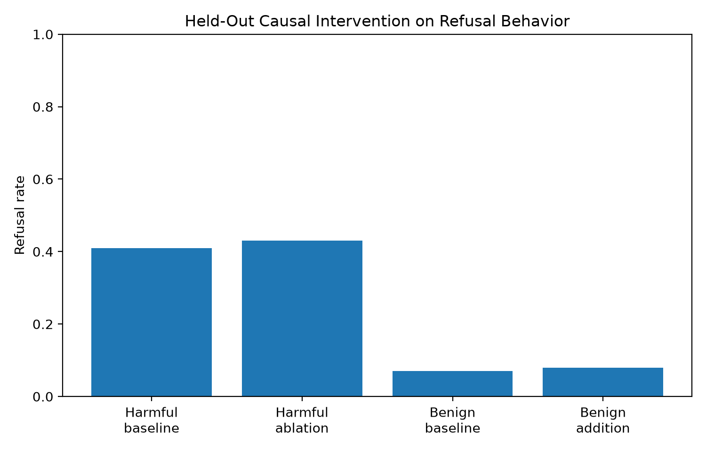
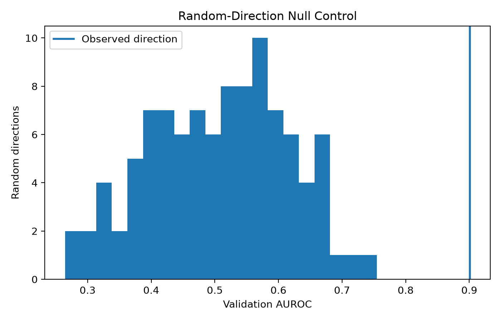

# LLM Refusal Interpretability

I built this repository to test whether safety-relevant behavior in an open language model can be localized to a low-dimensional direction in the residual stream, and whether manipulating that direction changes refusal behavior.

The project uses **Qwen2.5-1.5B-Instruct** and the gated **WildJailbreak** dataset. It combines representation analysis, linear probes, cross-style transfer, causal activation interventions, and explicit null controls.

The central question is not simply:

> Can hidden states predict whether a prompt is harmful?

It is:

> Is there a representation that is predictively associated with harmfulness, transfers across prompt styles, and is causally linked to refusal behavior rather than merely correlated with the labels?

## Results

The experiment produced strong evidence that **harmfulness information is represented and linearly accessible inside Qwen2.5-1.5B**, but it did **not** provide convincing evidence that the selected harmfulness-associated direction causally controls refusal behavior.

| Analysis | Result |
|---|---:|
| Mean-difference direction, selected block | 7 |
| Validation AUROC | 0.9012 |
| Held-out direction AUROC | **0.8753** |
| Direction test 95% CI | [0.8509, 0.8983] |
| Random-direction empirical p | 0.0099 |
| Vanilla → adversarial transfer AUROC | 0.7170 |
| Adversarial → vanilla transfer AUROC | 0.8097 |
| Best linear-probe block | 15 |
| Held-out probe AUROC | **0.9684** |
| Probe test 95% CI | [0.9573, 0.9781] |
| Shuffled-label empirical p | 0.0385 |



### Representation versus causality

The strongest simple harmful-minus-benign direction was found at **block 7**, while the strongest linear probe was selected at **block 15**.

This distinction matters. A representation can contain information that a probe can decode without that particular linear feature being the mechanism the model uses to produce its behavior.

The causal intervention therefore tested the block-7 direction directly on held-out prompts.

| Causal measurement | Result |
|---|---:|
| Harmful baseline refusal | 41% |
| Harmful refusal after ablation | 43% |
| Ablation delta | +2 pp |
| Ablation 95% CI | [-12 pp, +16 pp] |
| Benign baseline refusal | 7% |
| Benign refusal after addition | 8% |
| Addition delta | +1 pp |
| Addition 95% CI | [-6 pp, +9 pp] |



The ablation effect was not directionally consistent with the causal hypothesis, the addition effect was small, and both confidence intervals included zero.

I therefore **do not describe the discovered vector as a causal refusal direction**.

The supported conclusion is narrower:

> Qwen2.5-1.5B contains a strong, partially cross-style, linearly accessible harmfulness representation, but the tested mean-difference direction does not show convincing causal control over refusal behavior.

### Main research lesson

**Decodability is not causality.**

The linear probe reached **0.9684 held-out AUROC**, while manipulating the simpler harmfulness-associated direction produced little measurable change in refusal. This illustrates why mechanistic interpretability should distinguish information that can be decoded from a representation from information that the model actually uses causally.




## Experimental design

### Model

```text
Qwen/Qwen2.5-1.5B-Instruct
```

The default experiment operates on the base instruction model. The activation and causal-evaluation commands also support a PEFT adapter path, which allows the same analysis to be repeated on a fine-tuned model for before-versus-after comparison.

### Data

The default controlled subset contains:

```text
discovery:   800 prompts
validation:  400 prompts
test:        800 prompts
```

Each split is balanced across the four WildJailbreak categories:

```text
adversarial_benign
adversarial_harmful
vanilla_benign
vanilla_harmful
```

The three splits serve different purposes:

- **Discovery** estimates directions and trains probes.
- **Validation** selects the transformer block and other analysis choices.
- **Test** is held out until the analysis choices are fixed.

This prevents choosing a layer because it happens to look best on the final evaluation examples.

## Leakage control

WildJailbreak includes related source prompts and transformed adversarial variants. A naive random row split can therefore put semantically linked examples on both sides of the train-test boundary.

The data pipeline groups examples using:

- a stable hash of the source vanilla prompt,
- a stable hash of the normalized evaluated prompt,
- connected leakage groups that merge source-related and exact-prompt-related examples.

Groups are assigned to discovery, validation, or test as units. Balanced research subsets are sampled only after the group-level split is established.

The gated dataset itself is never committed to this repository.

## 1. Residual-stream activation extraction

For every prompt, the model is run with hidden-state output enabled. The pipeline extracts the activation at the **last prompt token** from every transformer block.

For a prompt \(x_i\), the extracted representation at layer \(\ell\) is conceptually:

```text
h_i^(ell) = residual-stream activation at the final prompt position
```

The repository stores these activations locally as compressed arrays. Raw prompt text is not copied into the activation files.

## 2. Mean-difference direction

At each transformer block, the discovery split is divided by ground-truth harmfulness.

The direction is:

```text
d_l = normalize(mean(harmful_l) - mean(benign_l))
```

A held-out prompt is scored by projecting its activation onto this direction.

The validation split is used to choose the block with the strongest AUROC. Only after that choice is frozen is the selected direction evaluated on the test split.

This matters because scanning every layer and reporting the best test layer would leak information from the test set into model selection.

## 3. Random-direction null control

A high AUROC is meaningful only relative to what arbitrary directions in a high-dimensional activation space can achieve.

The pipeline samples random unit vectors at the selected block and compares their validation AUROCs with the observed direction.

It reports:

- the observed validation AUROC,
- the random-direction AUROC distribution,
- an empirical null p-value.

This makes the directional-separation claim harder to obtain by chance.

## 4. Linear probe

The project also trains a regularized logistic-regression probe on each layer's activations.

The probe answers a different question from the mean-difference direction:

> How linearly decodable is harmfulness from the representation at this layer?

The best probe layer is selected on validation data, then evaluated once on the held-out test set.

### Shuffled-label null

The probe is repeated with permuted discovery labels. If a real-label probe strongly outperforms shuffled-label probes, that provides a basic sanity check against pipeline or dimensionality artifacts.

Probe performance is treated as **predictive evidence only**. It is not treated as evidence that the decoded feature causes the model's behavior.

## 5. Cross-style transfer

A safety-relevant representation is more interesting if it is not simply detecting the surface form of one prompt family.

The pipeline therefore evaluates:

```text
vanilla-derived direction      -> adversarial test prompts
adversarial-derived direction  -> vanilla test prompts
```

This asks whether the harmfulness signal transfers when prompt style changes.

Poor cross-style transfer would suggest that the direction may partly encode style-specific artifacts rather than a more general harmfulness representation.

## 6. Causal intervention

The most important stage asks whether the selected direction actually influences refusal behavior.

The evaluator first measures baseline refusal rates on held-out prompts. It then performs two directional interventions at the selected transformer block.

### Harmful-prompt ablation

For harmful prompts, the code removes the prompt token's displacement along the selected direction by projecting it toward the discovery-set center.

The question is:

> Does reducing this component reduce refusal behavior?

### Benign-prompt addition

For benign prompts, the code adds the direction by an amount calibrated to the discovery-set harmful-versus-benign projection gap.

The question is:

> Does increasing this component increase refusal behavior?

The intervention is applied to the current final token representation during forward passes, rather than indiscriminately rewriting every token in the sequence.

## 7. Causal null controls

Directional interventions can perturb a model even when the chosen vector has no meaningful interpretation.

The causal evaluator therefore repeats matched interventions with random directions and compares their changes in refusal rate with the selected direction's effect.

A convincing result should have all of the following:

- predictive separation on held-out activations,
- strong performance relative to random directions,
- cross-style transfer,
- a linear probe that beats shuffled-label controls,
- a directionally consistent causal effect,
- a causal effect materially larger than random-direction interventions.

If these conditions are not met, the result should be reported as weaker or mixed evidence.

## Refusal measurement

The causal stage generates short deterministic continuations and applies a conservative refusal-pattern detector.

The causal evaluator writes row-level non-text behavior metadata only to the ignored local `outputs/behavior/` directory. Public `results/` artifacts contain aggregate refusal statistics and null-control summaries.

**Raw model generations are not saved.**

This design avoids publishing generated harmful continuations or row-level gated-dataset evaluation records while still preserving auditable aggregate behavior measurements.

The heuristic refusal detector is also a limitation. A stronger follow-up would compare multiple refusal scorers or use a separately validated refusal classifier.

## Privacy and responsible release

The repository intentionally excludes:

```text
WildJailbreak raw rows
raw prompts
raw generated continuations
model checkpoints
adapter weights
Hugging Face tokens
```

The `.gitignore` prevents the primary local data and output directories from being committed accidentally. Activation tensors, learned direction vectors, row-level behavior records, model generations, and adapters stay under ignored local paths.

## Repository structure

```text
configs/
    default.yaml

src/
    prepare_data.py
    extract_activations.py
    discover_direction.py
    train_probe.py
    causal_eval.py
    report.py
    data.py
    activations.py
    directions.py
    probes.py
    interventions.py
    refusal.py
    modeling.py
    ...

scripts/
    run_pipeline.sh

tests/

results/
    README.md
```

## Setup

Python 3.11 is recommended.

```bash
bash setup.sh
source .venv/bin/activate
```

WildJailbreak is gated. Obtain access from its official Hugging Face page and authenticate locally before data preparation.

For example:

```bash
huggingface-cli login
```

No token should be committed to the repository.

## Run the experiment

### 1. Preflight

```bash
python -m src.preflight --config configs/default.yaml
```

### 2. Build the leakage-safe controlled dataset

```bash
python -m src.prepare_data --config configs/default.yaml
```

### 3. Extract activations

```bash
python -m src.extract_activations --config configs/default.yaml --split discovery
python -m src.extract_activations --config configs/default.yaml --split validation
python -m src.extract_activations --config configs/default.yaml --split test
```

### 4. Discover and validate the direction

```bash
python -m src.discover_direction --config configs/default.yaml
```

### 5. Train the linear probe and shuffled-label nulls

```bash
python -m src.train_probe --config configs/default.yaml
```

### 6. Run held-out causal interventions

```bash
python -m src.causal_eval --config configs/default.yaml
```

### 7. Generate figures and a result summary

```bash
python -m src.report --config configs/default.yaml
```

Or run the full sequence:

```bash
bash scripts/run_pipeline.sh
```

## Optional: compare the base model with a fine-tuned adapter

One valuable extension is to ask whether safety fine-tuning changes where harmfulness information is represented or how causally important the direction becomes.

Activation extraction supports a PEFT adapter:

```bash
python -m src.extract_activations \
  --config configs/default.yaml \
  --split discovery \
  --adapter-path /path/to/final_adapter
```

Repeat for validation and test, then run:

```bash
python -m src.discover_direction --config configs/default.yaml --suffix adapter
python -m src.train_probe --config configs/default.yaml --suffix adapter
python -m src.causal_eval \
  --config configs/default.yaml \
  --suffix adapter \
  --adapter-path /path/to/final_adapter
python -m src.report --config configs/default.yaml --suffix adapter
```

This makes it possible to compare the base model with a QLoRA-adapted model without mixing the two analyses.

## Generated research artifacts

After a complete run, `results/` includes artifacts such as:

```text
data_summary.json

direction_layers_base.csv
direction_summary_base.json
direction_random_null_base.csv

probe_layers_base.csv
probe_summary_base.json
probe_shuffled_null_base.csv

causal_summary_base.json
causal_random_null_base.csv

layer_auroc_base.png
direction_null_base.png
causal_refusal_base.png
SUMMARY_base.md
```

The result summary is generated from measured outputs rather than hard-coded headline numbers.

## What I would consider a defensible positive result

I would not interpret one perfect-looking metric as proof of a refusal mechanism.

A stronger claim would require converging evidence:

1. a direction learned only from the discovery split,
2. layer selection using validation data only,
3. strong held-out test separation,
4. performance above random-direction controls,
5. cross-style transfer,
6. probe performance above shuffled-label controls,
7. held-out causal intervention effects,
8. causal effects larger than random-direction effects.

Even then, the claim should remain model- and dataset-specific unless replicated across seeds, models, and datasets.

## Limitations

- Ground-truth harmfulness and actual refusal behavior are different variables. The repository keeps them separate intentionally.
- The mean-difference vector is a simple linear approximation to what may be a distributed nonlinear mechanism.
- The refusal detector is heuristic and should be validated further before making strong behavioral claims.
- The default experiment uses one model and one seed.
- WildJailbreak may contain dataset-specific cues that do not transfer to other jailbreak distributions.
- A causal effect at one layer does not prove that the model has a single unique refusal mechanism.
- Activation interventions can create off-distribution hidden states, which is why matched random-direction controls are included.

## Research extensions

The repository is structured to support several stronger follow-ups:

- repeat the full experiment across multiple random seeds,
- compare Qwen with other open instruction models,
- test transfer to a second jailbreak or safety dataset,
- replace the heuristic refusal detector with an independently validated scorer,
- compare base versus safety-fine-tuned representations,
- test subspace methods instead of a single direction,
- perform token-position and layer-specific causal sweeps,
- measure whether the intervention changes unrelated capabilities,
- test whether adversarial fine-tuning rotates, amplifies, or distributes the safety-relevant representation.

## Why this project matters

Mechanistic interpretability is most useful when it distinguishes **correlation, decodability, and causal involvement**.

This project is designed around that distinction. Rather than stopping after finding a linearly separable direction, it asks whether the representation survives distributional changes in prompt style, whether it beats explicit null controls, and whether manipulating it changes model behavior.

That makes the project useful not only as an interpretability exercise, but as a reproducible framework for testing claims about safety-relevant internal representations.

## Tests

The unit tests cover data-label parsing, direction construction, intervention mathematics, refusal detection, and privacy-sensitive output schemas.

```bash
pytest -q
```

## License

MIT. See [LICENSE](LICENSE).

## Citation

See [CITATION.cff](CITATION.cff).
